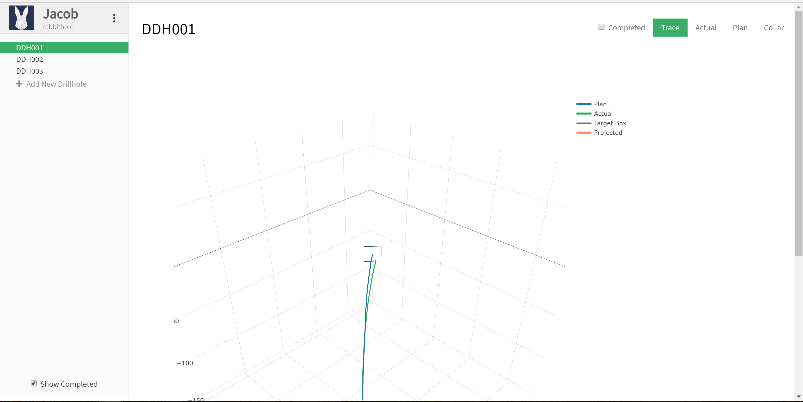
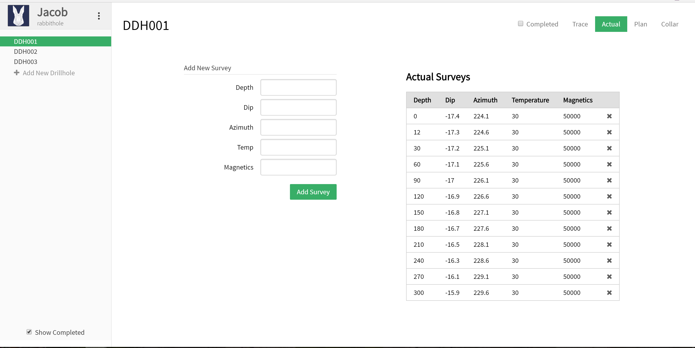
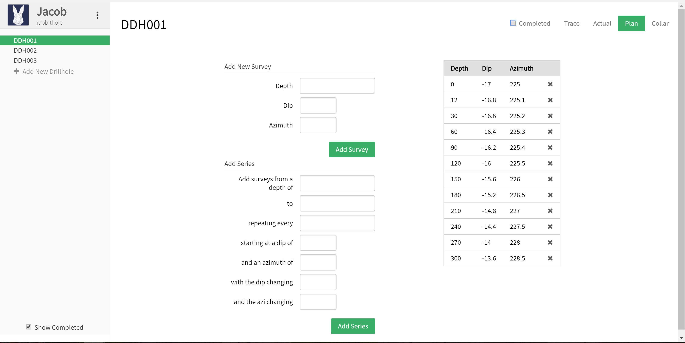
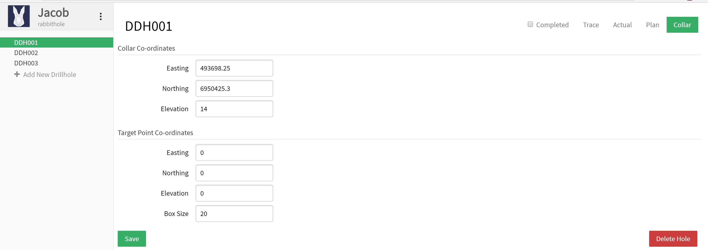

# Drillcurve
## A drillhole tracking web app

### Why build a drill hole tracking app?
This app aims to solve the problem in mining whereby the drilling team need to be able to quickly upload information on the current direction of a drillhole. The driller and the geologist can then immediately review the actual drill path against the plan and make any adjustments to drill technique or even stop the hole if necessary. Down time is very costly and this app aims to save hundreds of thousands in downtime, and the cost of redrilling holes by updating the methods of tracking drillholes into the 21st century.

Check it out [here](https://drillcurve.herokuapp.com).
Note if you aren't familiar with heroku, on the free tier if the app hasn't been open in a while the instance will need a few minutes to reactivate, so don't take it as a really long load time for the app!

### What is it made of?
The app is built using react/react, sass, and a heap of other useful packages. I have used a couple of PureCSS elements as well as font-awesome. All of the processing for calculating the downhole points for each drillhole is done in the front end to allow for the app to work offline as well (I had wanted to convert it to an electron app at some stage).

### How do I use it?
The app has three basic components to the interface: the sidebar, the top menu, and the main page below.
The sidebar shows the user, company, options menu and the list of drillholes. This is mostly used to select the drillhole to view or add data to. The options menu is accessed by clicking on the three vertical dots. New drillholes can be created by clicking on the *Add New Drillhole* button. Note this automatically switches to the collar page upon entering a new drillhole. The checkbox at the bottom enables switching between viewing all the drillholes and only viewing the uncompleted drillholes.

The top menu allows the user to switch between viewing the drillhole in 3D, and three separate data entry pages: Actual, Plan, and Collar. It also contains the checkbox where the user can mark the drillhole as complete.

The live demo opens straight into the app on the default trace page. This page shows a 3D plot of the drillhole, with its planned path, its actual path projected to the target depth. As well as some basic information below the trace. Note that this information is planned to be filled out and given some styling. This page is where the drillhole can be reviewed in detail, and decisions can be easily made based on how the hole is currently tracking. The graph can be panned, rotated, zoomed, screenshots taken, or exported to plotly.

The actual page is a simple data entry page that allows either the driller or geologist to enter the latest drilling information. In the future this will also optionally allow the user to input the barrel configuration information as well.

The plan page has two functions that allow the geologist to enter the planned deviation of the drillhole. A basic single depth data entry form. As well as the option to enter a series of values. Often the geologist may expect a certain build and turn rate for much of a hole. This function allows the user to enter a series of values with a given build and turn.

The final page is the collar page. This is where the collar point is entered and the target box information. Note if the target box is left as 0 for x, y, and z then the target will just be the end point of the planned drillhole. If the target box size is 0 then no target box will be drawn.

### What is the Future of the app?
The full app is still in alpha development and uses a firebase backend. It includes a login/user system, data syncronisation, and multiple users per company.
Other features that I would like to implement are:
* Add barrel information to data entry page.
* React Native version of the app for IOS and Android to allow data input from the field.
* An electron version of the app with offline support.
* Build a recommendation engine using historical data that will suggest barrel configurations to achieve the build and turn rates required to hit the target.

### Notes
This is only a demonstration of the app that was branched from the private repo before the app was hooked up to firebase and thus contains none of the backend code and is still missing a few features.
